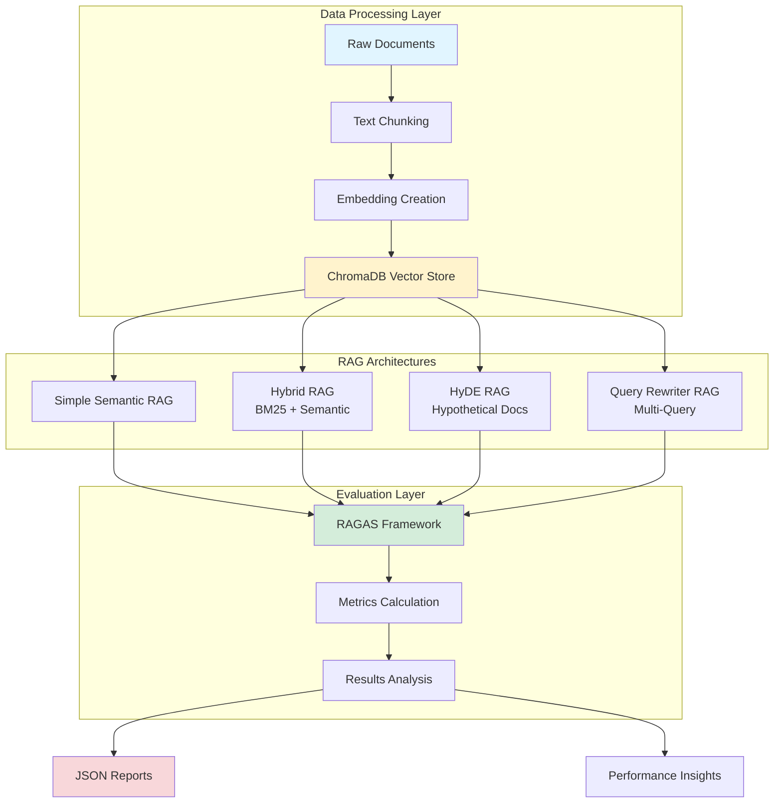
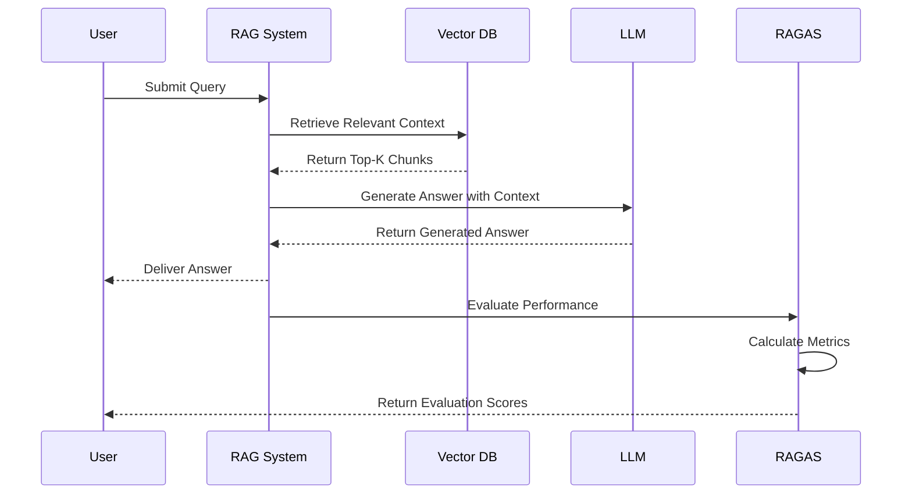
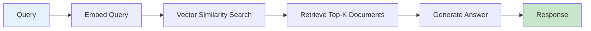
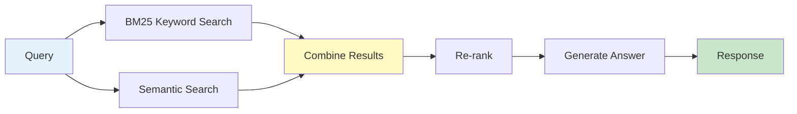
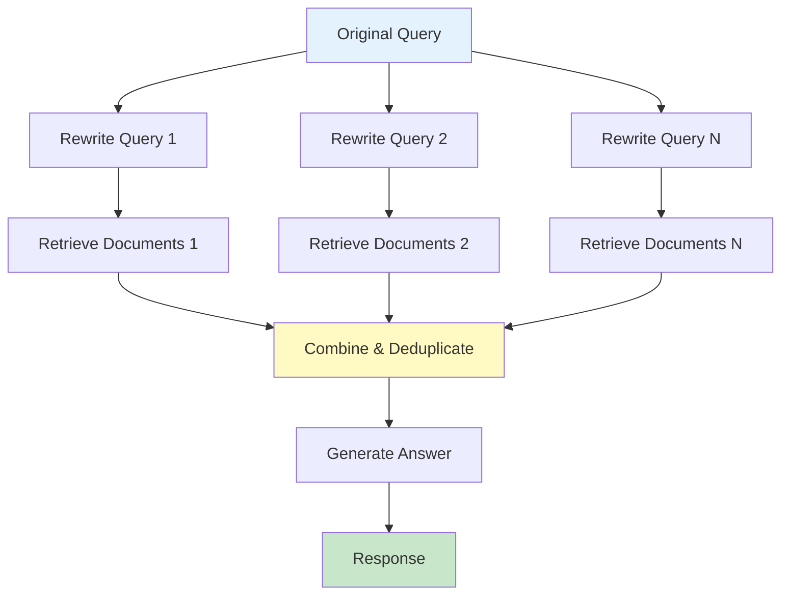
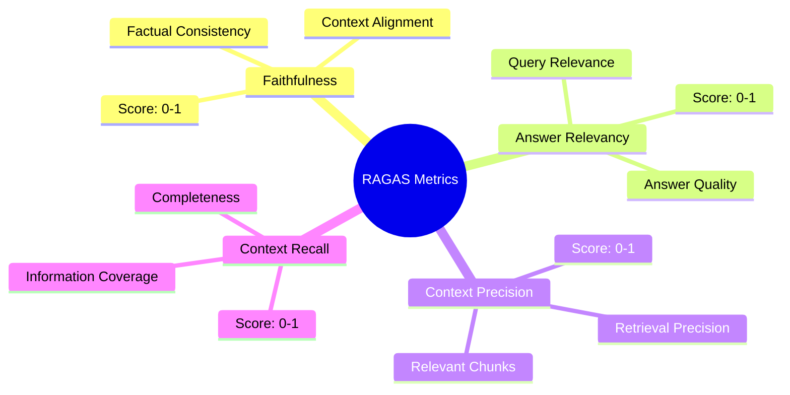
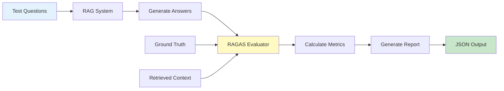
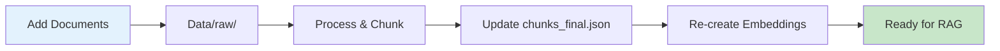
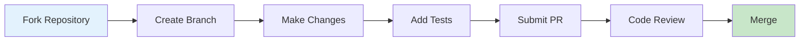

<div align="center">

# 🚀 RAG Benchmark System

### *A Comprehensive Benchmarking Framework for Retrieval-Augmented Generation Systems*

[](https://deepwiki.com/NicolasHoyosDevs/RAG-Benchmark)
[](https://www.python.org/downloads/)
[](https://opensource.org/licenses/MIT)
[](https://openai.com/)
[](https://langchain.com/)
[](https://github.com/explodinggradients/ragas)
[](https://github.com/NicolasHoyosDevs/RAG-Benchmark/issues)
[](https://github.com/NicolasHoyosDevs/RAG-Benchmark/stargazers)
[](https://github.com/NicolasHoyosDevs/RAG-Benchmark/network/members)

---

*Evaluate and compare multiple RAG architectures with comprehensive RAGAS metrics*

</div>

## 📑 Table of Contents

- [Overview](#-overview)
- [Key Features](#-key-features)
- [Architecture](#-architecture)
- [Project Structure](#-project-structure)
- [Quick Start](#-quick-start)
- [RAG Architectures](#-rag-architectures)
- [Evaluation Metrics](#-evaluation-metrics)
- [Usage](#-usage)
- [Results & Analysis](#-results--analysis)
- [Configuration](#️-configuration)
- [Customization](#-customization)
- [Contributing](#-contributing)
- [License](#-license)
- [Support & Contact](#-support--contact)

## 🎯 Overview

**RAG Benchmark System** is a professional-grade benchmarking framework designed to evaluate and compare Retrieval-Augmented Generation (RAG) systems using industry-standard RAGAS metrics. This project implements four distinct RAG architectures and provides comprehensive evaluation tools to help researchers and developers identify the best approach for their use case.

## ✨ Key Features

<table>
<tr>
<td width="50%">

### 📊 **Comprehensive Evaluation**
- RAGAS metric-based evaluation
- Multiple GPT model support
- Question-by-question analysis
- Aggregated performance metrics

</td>
<td width="50%">

### 🏗️ **Multiple Architectures**
- Simple Semantic RAG
- Hybrid RAG (BM25 + Semantic)
- HyDE RAG
- Query Rewriter RAG

</td>
</tr>
<tr>
<td width="50%">

### 🔄 **Complete Pipeline**
- Data processing & chunking
- Embedding creation & storage
- Vector database management
- Automated evaluation

</td>
<td width="50%">

### 📈 **Advanced Analysis**
- Performance comparison
- Model benchmarking
- JSON result exports
- Detailed reporting tools

</td>
</tr>
</table>

## 🏛️ Architecture



### 🔄 RAG Evaluation Workflow



## 📁 Project Structure

```
RAG-Benchmark/
├── 📂 Data/
│   ├── 📄 raw/                     # Raw documents
│   ├── 📄 processed/               # Processed documents
│   ├── 📄 chunks/                  # Text chunks (JSON)
│   ├── 📂 embeddings/              # Embedding creation and storage
│   │   ├── create_embeddings.py    # Create embeddings script
│   │   ├── test_retrieval.py       # Test retrieval functionality
│   │   ├── view_embeddings.py      # View embedding data
│   │   └── 🗄️ chroma_db/          # ChromaDB vector database
│   └── 📄 parsed_docs/             # Parsed document files
│
├── 📂 Simple_Semantic_RAG/         # Simple semantic search RAG
│   └── simple_semantic_rag.py
│
├── 📂 Hybrid_RAG/                  # Hybrid BM25 + Semantic RAG
│   └── hybrid_langchain_bm25.py
│
├── 📂 HyDE_RAG/                    # Hypothetical Document Embeddings RAG
│   └── hyde_rag.py
│
├── 📂 Query_Rewriter_RAG/          # Query rewriting RAG
│   └── main_rewriter.py
│
├── 📂 results/                     # Evaluation results and analysis
│   ├── ragas_evaluator.py          # Main evaluation script
│   ├── utils.py                    # Utility functions
│   ├── ragas_analysis/             # Analysis tools and reports
│   └── 📊 [JSON files]             # Evaluation results
│
├── benchmark_ragas.py              # Benchmark script
├── test_comparison.py              # Comparison testing
├── requirements.txt                # Python dependencies
├── .env.example                    # Environment variables template
└── README.md                       # This file
```

## 🚀 Quick Start

### Prerequisites

Before you begin, ensure you have the following installed:

| Requirement | Version | Purpose |
|------------|---------|---------|
| 🐍 Python | 3.8+ | Runtime environment |
| 🔑 OpenAI API Key | - | LLM & embeddings access |
| 📦 Git | Latest | Version control |

### Installation

#### 1️⃣ Clone the Repository

```bash
git clone https://github.com/NicolasHoyosDevs/RAG-Benchmark.git
cd RAG-Benchmark
```

#### 2️⃣ Install Dependencies

```bash
# Using pip
pip install -r requirements.txt

# Or using a virtual environment (recommended)
python -m venv venv
source venv/bin/activate  # On Windows: venv\Scripts\activate
pip install -r requirements.txt
```

#### 3️⃣ Configure Environment

Create a `.env` file in the root directory:

```bash
# Copy the example file
cp .env.example .env

# Edit .env and add your OpenAI API key
OPENAI_API_KEY=your_openai_api_key_here
```

> ⚠️ **Important**: Never commit your `.env` file with real API keys!

#### 4️⃣ Prepare Data

##### **Option A**: Use Existing Data (Recommended for Quick Start)

The project includes pre-processed data. You can skip to step 5.

##### **Option B**: Process Your Own Documents

If you want to use custom documents:

1. Place your documents in `Data/raw/`
2. Run the preprocessing pipeline (if available)
3. Create chunks and embeddings

#### 5️⃣ Create Embeddings

```bash
cd Data/embeddings
python create_embeddings.py
```

**This script will:**
- ✅ Load text chunks from `Data/chunks/chunks_final.json`
- ✅ Create embeddings using OpenAI's `text-embedding-3-small`
- ✅ Store embeddings in ChromaDB at `Data/embeddings/chroma_db/`

> 💡 **Tip**: Embedding creation may take several minutes depending on data size.

## 🏗️ RAG Architectures

This project implements four distinct RAG architectures, each with unique strengths:

### 1️⃣ Simple Semantic RAG



**Characteristics:**
- ⚡ Fast and straightforward approach
- 🎯 Uses semantic similarity search
- 📊 Direct retrieval from vector database
- ✅ Best for: Simple, direct queries

**Implementation:** `Simple_Semantic_RAG/simple_semantic_rag.py`

---

### 2️⃣ Hybrid RAG (BM25 + Semantic)



**Characteristics:**
- 🔀 Combines BM25 keyword + semantic search
- 🎯 Better retrieval accuracy for diverse queries
- ⚖️ Balances precision and recall
- ✅ Best for: Mixed keyword and semantic queries

**Implementation:** `Hybrid_RAG/hybrid_langchain_bm25.py`

---

### 3️⃣ HyDE RAG (Hypothetical Document Embeddings)


**Characteristics:**
- 🧠 Generates hypothetical documents for queries
- 🔍 Uses embeddings of hypothetical content
- 🎯 Effective for complex or abstract queries
- ✅ Best for: Abstract or conceptual questions

**Implementation:** `HyDE_RAG/hyde_rag.py`

---

### 4️⃣ Query Rewriter RAG



**Characteristics:**
- 🔄 Rewrites queries in multiple ways
- 📚 Performs multiple retrievals with different formulations
- 🎯 Improves results for ambiguous queries
- ✅ Best for: Ambiguous or multi-faceted questions

**Implementation:** `Query_Rewriter_RAG/main_rewriter.py`

---

### 📊 Architecture Comparison

| Architecture | Speed | Accuracy | Complexity | Best Use Case |
|-------------|-------|----------|------------|---------------|
| Simple Semantic | ⚡⚡⚡ | ⭐⭐⭐ | 🔧 | Direct queries |
| Hybrid | ⚡⚡ | ⭐⭐⭐⭐ | 🔧🔧 | Mixed queries |
| HyDE | ⚡⚡ | ⭐⭐⭐⭐ | 🔧🔧🔧 | Abstract queries |
| Query Rewriter | ⚡ | ⭐⭐⭐⭐⭐ | 🔧🔧🔧 | Ambiguous queries |

## 📊 Evaluation Metrics

The system uses **RAGAS** (Retrieval-Augmented Generation Assessment) for comprehensive evaluation.

### Core Metrics



### Metric Details

<table>
<tr>
<th>Metric</th>
<th>Description</th>
<th>Score Range</th>
<th>Interpretation</th>
</tr>
<tr>
<td><strong>🎯 Faithfulness</strong></td>
<td>Measures how well the generated answer aligns with the retrieved context</td>
<td>0.0 - 1.0</td>
<td>Higher = More factually consistent</td>
</tr>
<tr>
<td><strong>💡 Answer Relevancy</strong></td>
<td>Evaluates how relevant the answer is to the original question</td>
<td>0.0 - 1.0</td>
<td>Higher = More relevant response</td>
</tr>
<tr>
<td><strong>🔍 Context Precision</strong></td>
<td>Measures the precision of retrieved context chunks</td>
<td>0.0 - 1.0</td>
<td>Higher = More precise retrieval</td>
</tr>
<tr>
<td><strong>📚 Context Recall</strong></td>
<td>Evaluates how well the context covers the ground truth</td>
<td>0.0 - 1.0</td>
<td>Higher = Better coverage</td>
</tr>
</table>

### Evaluation Process



## 💻 Usage

### Command Reference

#### Individual RAG Evaluation

Evaluate each RAG system individually:

```bash
# 🔵 Simple Semantic RAG
python results/ragas_evaluator.py simple

# 🟢 Hybrid RAG
python results/ragas_evaluator.py hybrid

# 🟡 HyDE RAG
python results/ragas_evaluator.py hyde

# 🟣 Query Rewriter RAG
python results/ragas_evaluator.py rewriter
```

#### Multi-Model Evaluation

Evaluate a specific RAG with multiple models:

```bash
# Evaluate Hybrid RAG with all models
python results/ragas_evaluator.py multi-model hybrid

# Evaluate Simple RAG with all models
python results/ragas_evaluator.py multi-model simple
```

**Supported Models:**
- `gpt-3.5-turbo` - Fast and cost-effective
- `gpt-4o` - Latest GPT-4 optimized model
- `gpt-4o-mini` - Smaller, faster GPT-4 variant
- `gpt-4` - Most capable model

#### Comprehensive Evaluation

Evaluate all RAGs with all models in a single run:

```bash
python results/ragas_evaluator.py all-models-all-rags
```

**This command will:**
- ✅ Test all 4 RAG architectures
- ✅ Use all 4 GPT models
- ✅ Generate 16 evaluation runs (4 RAGs × 4 models)
- ✅ Create a consolidated JSON file with all results
- ⏱️ Estimated time: 15-30 minutes

#### Utility Commands

```bash
# 📊 Run benchmark script
python benchmark_ragas.py

# 🔍 Run comparison tests
python test_comparison.py

# 👁️ View embedding data
cd Data/embeddings
python view_embeddings.py

# 🧪 Test retrieval functionality
cd Data/embeddings
python test_retrieval.py
```

### Example Workflow

```bash
# 1. Create embeddings (first time only)
cd Data/embeddings
python create_embeddings.py

# 2. Test individual RAG
cd ../..
python results/ragas_evaluator.py hybrid

# 3. Compare all architectures
python results/ragas_evaluator.py all-models-all-rags

# 4. Analyze results
cd results/ragas_analysis
# View generated JSON files and reports
```

## 📈 Results & Analysis

### Output Files

Results are automatically saved in the `results/` directory as JSON files:

| File Pattern | Description | Content |
|-------------|-------------|---------|
| `ragas_evaluation_[type]_[timestamp].json` | Individual RAG evaluation | Single RAG + single model results |
| `ragas_comprehensive_all_rags_all_models_[timestamp].json` | Comprehensive evaluation | All RAGs + all models results |

### JSON Output Structure

#### Individual RAG Evaluation JSON Structure
```json
{
  "metadata": {
    "rag_type": "hybrid",
    "model_used": "gpt-4o",
    "timestamp": "20250830_181136",
    "total_questions": 5,
    "evaluation_duration": "45.2s"
  },
  "rag_results": {
    "faithfulness": 0.85,
    "answer_relevancy": 0.78,
    "context_precision": 0.92,
    "context_recall": 0.76
  },
  "question_by_question": [
    {
      "question": "What are the main stages of pregnancy?",
      "ground_truth": "Pregnancy is divided into three trimesters...",
      "answer": "Pregnancy consists of three main trimesters...",
      "contexts": ["Pregnancy is divided into...", "First trimester includes..."],
      "faithfulness": 0.88,
      "answer_relevancy": 0.82,
      "context_precision": 0.95,
      "context_recall": 0.79
    }
  ]
}
```

#### Comprehensive All-Models-All-RAGs JSON Structure
```json
{
  "metadata": {
    "evaluation_type": "all-models-all-rags",
    "timestamp": "20250830_181136",
    "total_evaluations": 16,
    "total_questions": 5,
    "models_tested": ["gpt-3.5-turbo", "gpt-4o", "gpt-4o-mini", "gpt-4"],
    "rags_tested": ["simple", "hybrid", "hyde", "rewriter"]
  },
  "summary": {
    "best_performing_rag": "hybrid",
    "best_performing_model": "gpt-4",
    "highest_faithfulness": 0.89,
    "highest_answer_relevancy": 0.84
  },
  "rag_results": {
    "simple": {
      "gpt-3.5-turbo": {
        "faithfulness": 0.78,
        "answer_relevancy": 0.72,
        "context_precision": 0.85,
        "context_recall": 0.69
      },
      "gpt-4o": {
        "faithfulness": 0.82,
        "answer_relevancy": 0.76,
        "context_precision": 0.88,
        "context_recall": 0.73
      }
    },
    "hybrid": {
      "gpt-3.5-turbo": {
        "faithfulness": 0.85,
        "answer_relevancy": 0.79,
        "context_precision": 0.91,
        "context_recall": 0.75
      },
      "gpt-4o": {
        "faithfulness": 0.89,
        "answer_relevancy": 0.84,
        "context_precision": 0.94,
        "context_recall": 0.81
      }
    },
    "hyde": {
      "gpt-3.5-turbo": {
        "faithfulness": 0.81,
        "answer_relevancy": 0.77,
        "context_precision": 0.87,
        "context_recall": 0.71
      }
    },
    "rewriter": {
      "gpt-3.5-turbo": {
        "faithfulness": 0.83,
        "answer_relevancy": 0.78,
        "context_precision": 0.89,
        "context_recall": 0.74
      }
    }
  },
  "detailed_results": {
    "simple_gpt-3.5-turbo": {
      "metadata": {
        "rag_type": "simple",
        "model_used": "gpt-3.5-turbo",
        "timestamp": "20250830_181136"
      },
      "question_by_question": [...]
    }
  }
}
```

#### Key JSON Fields Explained

| Field | Description | Example |
|-------|-------------|---------|
| `metadata` | Evaluation information (RAG type, model, timestamp) | `{"rag_type": "hybrid", "model": "gpt-4o"}` |
| `rag_results` | Aggregated metrics for the evaluation | `{"faithfulness": 0.85}` |
| `question_by_question` | Detailed results for each test question | Array of question objects |
| `summary` | Overview of best performers | `{"best_performing_rag": "hybrid"}` |
| `detailed_results` | Complete breakdown by RAG-model combo | Nested object structure |

#### Metrics Quick Reference

| Metric | Range | Interpretation | Good Score |
|--------|-------|----------------|------------|
| **Faithfulness** | 0-1 | Answer matches retrieved context | > 0.8 |
| **Answer Relevancy** | 0-1 | Answer relevance to question | > 0.75 |
| **Context Precision** | 0-1 | Precision of retrieved chunks | > 0.85 |
| **Context Recall** | 0-1 | Context covers ground truth | > 0.7 |

### Analysis Tools

The `results/ragas_analysis/` directory contains tools for:
- 📊 Viewing detailed metrics
- 🔍 Comparing performance across RAGs and models
- 📈 Generating reports and visualizations
- 📉 Identifying performance patterns

## ⚙️ Configuration

### Environment Variables

Configure the system using a `.env` file:

```bash
# Required
OPENAI_API_KEY=your_openai_api_key_here

# Optional (with defaults)
# EMBEDDING_MODEL=text-embedding-3-small
# CHUNK_SIZE=500
# CHUNK_OVERLAP=50
```

### Supported Models

The system supports the following OpenAI models:

<table>
<tr>
<th>Model</th>
<th>Speed</th>
<th>Quality</th>
<th>Cost</th>
<th>Best For</th>
</tr>
<tr>
<td><code>gpt-3.5-turbo</code></td>
<td>⚡⚡⚡</td>
<td>⭐⭐⭐</td>
<td>💰</td>
<td>Fast prototyping</td>
</tr>
<tr>
<td><code>gpt-4o-mini</code></td>
<td>⚡⚡</td>
<td>⭐⭐⭐⭐</td>
<td>💰💰</td>
<td>Balanced performance</td>
</tr>
<tr>
<td><code>gpt-4o</code></td>
<td>⚡⚡</td>
<td>⭐⭐⭐⭐⭐</td>
<td>💰💰💰</td>
<td>Latest optimized model</td>
</tr>
<tr>
<td><code>gpt-4</code></td>
<td>⚡</td>
<td>⭐⭐⭐⭐⭐</td>
<td>💰💰💰💰</td>
<td>Highest quality</td>
</tr>
</table>

> 💡 **Note**: Models are automatically switched during multi-model evaluations.

## 🔧 Customization

### Adding New Documents



**Steps:**
1. 📁 Place documents in `Data/raw/`
2. 🔄 Process them into chunks
3. 📝 Update `Data/chunks/chunks_final.json`
4. 🔁 Re-run embedding creation

### Modifying RAG Parameters

Edit the respective RAG implementation files:

| RAG Type | File Location | Key Parameters |
|----------|---------------|----------------|
| Simple Semantic | `Simple_Semantic_RAG/simple_semantic_rag.py` | `k`, `similarity_threshold` |
| Hybrid | `Hybrid_RAG/hybrid_langchain_bm25.py` | `k`, `alpha` (BM25 weight) |
| HyDE | `HyDE_RAG/hyde_rag.py` | `k`, `num_hypothetical_docs` |
| Query Rewriter | `Query_Rewriter_RAG/main_rewriter.py` | `k`, `num_rewrites` |

### Custom Evaluation Metrics

Modify `results/ragas_evaluator.py` to add custom metrics:

```python
# Example: Add a custom metric
from ragas.metrics import your_custom_metric

metrics = [
    faithfulness,
    answer_relevancy,
    context_precision,
    context_recall,
    your_custom_metric  # Add here
]
```

### Advanced Configuration

#### Document Processing
- **Chunking**: Adjust `CHUNK_SIZE` and `CHUNK_OVERLAP` in embedding scripts
- **Embeddings**: Change embedding model in `create_embeddings.py`
- **Vector Store**: ChromaDB configuration in `Data/embeddings/`

#### RAG Pipeline
Each RAG module includes:
- 📥 Document ingestion logic
- 🔍 Query processing pipeline
- 🎯 Retrieval algorithms
- 💬 Response generation methods

## 🤝 Contributing

We welcome contributions from the community! Here's how you can help:

### Contribution Guidelines



**Steps:**
1. 🍴 Fork the repository
2. 🌿 Create a feature branch (`git checkout -b feature/amazing-feature`)
3. ✍️ Make your changes
4. ✅ Add tests if applicable
5. 📝 Commit your changes (`git commit -m 'Add amazing feature'`)
6. 🚀 Push to the branch (`git push origin feature/amazing-feature`)
7. 🎯 Submit a pull request

### Development Guidelines

- ✨ Follow PEP 8 style guidelines for Python code
- 📝 Add docstrings to all functions and classes
- 🧪 Include unit tests for new features
- 📚 Update documentation as needed
- 🔍 Ensure all tests pass before submitting

### Areas for Contribution

- 🆕 New RAG architectures
- 📊 Additional evaluation metrics
- 🐛 Bug fixes and improvements
- 📖 Documentation enhancements
- 🎨 Visualization tools
- ⚡ Performance optimizations

## 📄 License

This project is licensed under the **MIT License**.

```
MIT License

Copyright (c) 2024 Nicolas Hoyos

Permission is hereby granted, free of charge, to any person obtaining a copy
of this software and associated documentation files (the "Software"), to deal
in the Software without restriction, including without limitation the rights
to use, copy, modify, merge, publish, distribute, sublicense, and/or sell
copies of the Software.
```

See the [LICENSE](LICENSE) file for full details.

## 💬 Support & Contact

<div align="center">

### Need Help?

| Resource | Link | Description |
|----------|------|-------------|
| 🐛 **Report Issues** | [GitHub Issues](https://github.com/NicolasHoyosDevs/RAG-Benchmark/issues) | Bug reports and feature requests |
| 💬 **Discussions** | [GitHub Discussions](https://github.com/NicolasHoyosDevs/RAG-Benchmark/discussions) | Questions and community chat |
| 📚 **Documentation** | This README | Comprehensive guide |
| 👨‍💻 **Author** | [@NicolasHoyosDevs](https://github.com/NicolasHoyosDevs) | Project maintainer |

</div>

## 📋 Example Usage

### Basic Evaluation

```python
# Example: Evaluate Hybrid RAG
from results.ragas_evaluator import RAGASEvaluator

# Initialize evaluator
evaluator = RAGASEvaluator()

# Run evaluation
results = evaluator.evaluate_rag("hybrid", "gpt-4o")

# Display results
print(f"Faithfulness: {results['faithfulness']:.3f}")
print(f"Answer Relevancy: {results['answer_relevancy']:.3f}")
print(f"Context Precision: {results['context_precision']:.3f}")
print(f"Context Recall: {results['context_recall']:.3f}")
```

### Advanced Usage

```python
# Compare multiple RAG architectures
from results.ragas_evaluator import compare_rags

rag_types = ["simple", "hybrid", "hyde", "rewriter"]
model = "gpt-4o"

comparison_results = compare_rags(rag_types, model)

# Analyze best performing architecture
best_rag = max(comparison_results.items(), 
               key=lambda x: x[1]['faithfulness'])
print(f"Best RAG: {best_rag[0]} with faithfulness: {best_rag[1]['faithfulness']:.3f}")
```

For more advanced usage, explore the individual RAG implementation files and the evaluation script.

## 🎓 Citation

If you use this benchmark in your research, please cite:

```bibtex
@software{rag_benchmark_2024,
  author = {Hoyos, Nicolas},
  title = {RAG Benchmark System: A Comprehensive Framework for Evaluating Retrieval-Augmented Generation},
  year = {2024},
  url = {https://github.com/NicolasHoyosDevs/RAG-Benchmark}
}
```

## 🌟 Acknowledgments

This project leverages several excellent open-source projects:

- 🦜 [LangChain](https://langchain.com/) - RAG framework
- 📊 [RAGAS](https://github.com/explodinggradients/ragas) - Evaluation metrics
- 🤖 [OpenAI](https://openai.com/) - LLM and embeddings
- 🗄️ [ChromaDB](https://www.trychroma.com/) - Vector database

Special thanks to the open-source community for their contributions!

---

<div align="center">

**⭐ Star this repository if you find it helpful!**

Made with ❤️ by [Nicolas Hoyos](https://github.com/NicolasHoyosDevs)

[Report Bug](https://github.com/NicolasHoyosDevs/RAG-Benchmark/issues) · [Request Feature](https://github.com/NicolasHoyosDevs/RAG-Benchmark/issues) · [Contribute](https://github.com/NicolasHoyosDevs/RAG-Benchmark/pulls)

</div>
