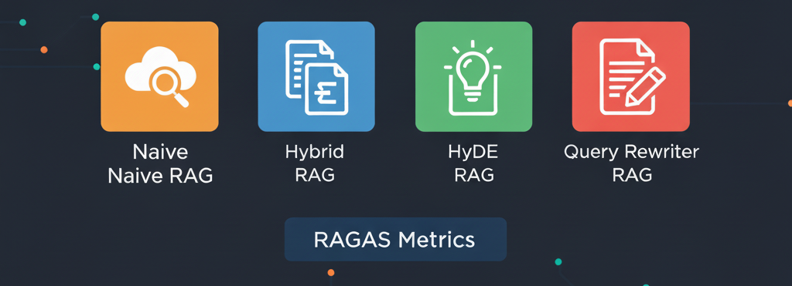

<div align="center">
  <h1> 🚀 RAG Benchmark System</h1>
  
  <br><br>
  <span style="zoom:1.3;">
    <a href="https://opensource.org/licenses/MIT"></a>
    <a href="https://www.python.org/downloads/"></a>
    <a href="https://openai.com/"></a>
    <a href="https://langchain.com/"></a>
    <a href="https://github.com/explodinggradients/ragas"></a>
    <!-- <a href="https://github.com/NicolasHoyosDevs/RAG-Benchmark/issues"></a>
    <a href="https://github.com/NicolasHoyosDevs/RAG-Benchmark/stargazers"></a>
    <a href="https://github.com/NicolasHoyosDevs/RAG-Benchmark/network/members"></a> -->
  </span>
</div>

A comprehensive benchmarking framework for evaluating Retrieval-Augmented Generation (RAG) systems using RAGAS metrics. This project implements and compares multiple RAG architectures including Simple Semantic RAG, Hybrid RAG (BM25 + Semantic), HyDE RAG, and Query Rewriter RAG. Supports both OpenAI models (GPT-5, GPT-4.1) and HuggingFace SLMs (MediPhi, MedGemma) via vLLM/HF Inference Endpoints.

---

*Evaluate and compare multiple RAG architectures with comprehensive RAGAS metrics across different LLM/SLM providers*

## Table of Contents

- [Overview](#overview)
- [Quick Start](#quick-start)
- [Project Structure](#project-structure)
- [Model Provider Abstraction](#model-provider-abstraction)
- [RAG Architectures](#rag-architectures)
- [Evaluation Metrics](#evaluation-metrics)
- [Usage](#usage)
- [Testing](#testing)
- [Results and Analysis](#results-and-analysis)
- [Configuration](#configuration)
- [Customization](#customization)
- [Contributing](#contributing)
- [License](#license)


## Overview

RAG Benchmark System is a professional-grade benchmarking framework designed to evaluate and compare Retrieval-Augmented Generation (RAG) systems using industry-standard RAGAS metrics. Implementa cuatro arquitecturas RAG distintas con soporte para múltiples proveedores de modelos (OpenAI y HuggingFace).

### Key Capabilities

- **Multi-Provider LLM Support**: OpenAI models (gpt-5, gpt-4.1) + HuggingFace SLMs (MediPhi, MedGemma) via Inference Endpoints
- **Multiple RAG Architectures**: Simple Semantic, Hybrid (BM25 + Semantic), HyDE, Query Rewriter
- **Factory Pattern**: Unified `ModelConfig` and `create_llm()` factory for seamless model switching
- **Comprehensive Evaluation**: RAGAS metrics (faithfulness, answer_relevancy, context_precision, context_recall)
- **Complete Pipeline**: Data processing, embeddings, vector storage, automated evaluation, JSON reports
- **Performance Tracking**: Token count, execution time, and cost tracking per evaluation

## Quick Start

### Prerequisites

- Python 3.10+
- OpenAI API key
- Git

### Installation & Setup

1. **Clone the repository**
```bash
git clone https://github.com/NicolasHoyosDevs/RAG-Benchmark.git
cd RAG-Benchmark
```

2. **Create Python environment**
```bash
python -m venv .venv
source .venv/bin/activate  # On Windows: .venv\Scripts\activate
```

3. **Install dependencies**
```bash
pip install -r requirements.txt
```

4. **Configure environment variables**

Create a `.env` file in the root directory with required variables:

```bash
# OpenAI API (required for embeddings and GPT models)
OPENAI_API_KEY=sk-...

# HuggingFace API (required only if using MediPhi/MedGemma)
HF_TOKEN=hf_...

# HuggingFace Inference Endpoints (optional, for SLM models)
MEDIPHI_ENDPOINT_URL=https://your-mediphi-endpoint.huggingface.co
MEDGEMMA_ENDPOINT_URL=https://your-medgemma-endpoint.huggingface.co
```

5. **Initialize vector database**
```bash
python scripts/create_embeddings.py
```

This command:
- Loads 2364 text chunks from `data/chunks/chunks_final.json`
- Creates embeddings using OpenAI's `text-embedding-3-small`
- Stores them in ChromaDB at `data/embeddings/chroma_db/`

6. **Run a quick test**
```bash
# Test Simple RAG with default OpenAI model
python scripts/run_evaluation.py simple

# Test with HuggingFace MediPhi (if endpoint configured)
python -c "
from src.common.model_provider import create_llm, MODELS_REGISTRY
from src.rag.simple import query_for_evaluation

mediphi = create_llm(MODELS_REGISTRY['mediphi'])
result = query_for_evaluation('¿Cuándo se considera inicio tardío de controles prenatales?', custom_llm=mediphi)
print('Answer:', result['answer'][:200])
"
```

## Project Structure

```
RAG-Benchmark/
├── src/
│   ├── common/
│   │   ├── model_provider.py      # Factory for LLM/SLM instantiation
│   │   └── utils.py               # Shared utilities (export_ragas_analysis)
│   ├── rag/
│   │   ├── simple.py              # Simple Semantic RAG
│   │   ├── hybrid.py              # Hybrid RAG (BM25 + Semantic)
│   │   ├── hyde.py                # HyDE RAG (Hypothetical Documents)
│   │   └── rewriter.py            # Query Rewriter RAG
│   └── evaluation/
│       └── ragas_evaluator.py      # RAGAS orchestrator & multi-model evaluation
├── scripts/
│   ├── create_embeddings.py        # Generate & store embeddings
│   ├── run_evaluation.py           # CLI for single/multi-model evaluation
│   ├── test_retrieval.py           # Quick retrieval validation
│   └── view_embeddings.py          # Inspect vector store
├── tests/
│   └── test_mediphi_endpoint.py    # Integration tests for HF endpoint
├── data/
│   ├── raw/                        # Raw source documents
│   ├── processed/                  # Cleaned/structured documents
│   ├── chunks/
│   │   └── chunks_final.json       # 2364 processed text chunks
│   └── embeddings/
│       └── chroma_db/              # ChromaDB persistent store
├── results/                        # Evaluation output (JSON/CSV)
├── docs/                           # Architecture guides
├── .env                            # Environment variables (create from template)
├── .env.example                    # Environment template
├── requirements.txt                # Python dependencies with versions
└── README.md                       # This file
```

## Model Provider Abstraction

The system provides a unified interface for both OpenAI and HuggingFace models through `src/common/model_provider.py`:

### Supported Models

| Model | Provider | Type | Endpoint |
|-------|----------|------|----------|
| `gpt-5`, `gpt-4.1` | OpenAI | LLM | api.openai.com |
| `mediphi` | HuggingFace | SLM | vLLM/HF Inference Endpoint |
| `medgemma` | HuggingFace | SLM | vLLM/HF Inference Endpoint |

### Usage Example

```python
from src.common.model_provider import create_llm, MODELS_REGISTRY

# Create OpenAI model
gpt_model = create_llm(MODELS_REGISTRY["gpt-4.1"])

# Create HuggingFace model (requires MEDIPHI_ENDPOINT_URL and HF_TOKEN in .env)
mediphi_model = create_llm(MODELS_REGISTRY["mediphi"])

# Use with any RAG
from src.rag.simple import query_for_evaluation
result = query_for_evaluation("Your question?", custom_llm=mediphi_model)
```

### Adding New Models

1. Update `src/common/model_provider.py` - `MODELS_REGISTRY`:
```python
"my-model": ModelConfig(
    name="my-model",
    model_id="org/model-id",
    provider="openai|huggingface",
    endpoint_url_env="MY_ENDPOINT_URL",  # Only for HuggingFace
    temperature=0.0
)
```

2. Add environment variables to `.env`:
```bash
MY_ENDPOINT_URL=https://your-endpoint-url
```

## RAG Architectures

This project implements four distinct RAG architectures:

### 1. Simple Semantic RAG
- **File**: `src/rag/simple.py`
- Vector-based semantic search using ChromaDB
- Direct, fast retrieval
- **Best for**: Straightforward queries with clear semantic intent

### 2. Hybrid RAG (BM25 + Semantic)
- **File**: `src/rag/hybrid.py`
- Combines keyword (BM25) and semantic search via EnsembleRetriever
- Improved recall for diverse query types
- **Best for**: Mixed keyword and semantic queries

### 3. HyDE RAG (Hypothetical Document Embeddings)
- **File**: `src/rag/hyde.py`
- Generates multiple hypothetical documents for a query
- Embeds hypothetical content for retrieval
- **Best for**: Abstract or conceptual questions

### 4. Query Rewriter RAG
- **File**: `src/rag/rewriter.py`
- Rewrites queries multiple ways using an LLM
- Performs multiple retrievals with different formulations
- **Best for**: Ambiguous or complex multi-faceted questions

## Evaluation Metrics

RAGAS evaluates RAG systems on four fundamental metrics:

| Metric | Description | Range |
|--------|-------------|-------|
| **Faithfulness** | How closely the response adheres to retrieved context (avoiding hallucinations) | 0-1 |
| **Answer Relevancy** | How well the answer addresses the user's question | 0-1 |
| **Context Precision** | Proportion of retrieved context that supports the answer | 0-1 |
| **Context Recall** | Proportion of necessary information captured in retrieved context | 0-1

## Usage

### Single RAG Evaluation (Default OpenAI Model)

```bash
# Simple Semantic RAG
python scripts/run_evaluation.py simple

# Hybrid RAG (BM25 + Semantic)
python scripts/run_evaluation.py hybrid

# HyDE RAG
python scripts/run_evaluation.py hyde

# Query Rewriter RAG
python scripts/run_evaluation.py rewriter

# Both original RAGs (rewriter + hybrid)
python scripts/run_evaluation.py both

# All 4 RAG types sequentially
python scripts/run_evaluation.py all
```

### Multi-Model Evaluation

Evaluate a single RAG type against all configured models:

```bash
# Test Simple RAG with all models (gpt-5, gpt-4.1, mediphi, medgemma)
python scripts/run_evaluation.py multi-model simple

# Test Hybrid RAG with all models
python scripts/run_evaluation.py multi-model hybrid
```

### Comprehensive Evaluation (All RAGs × All Models)

```bash
# 4 RAGs × 4 models = 16 complete evaluations
python scripts/run_evaluation.py all-models-all-rags
```

This generates a consolidated JSON report: `results/ragas_comprehensive_all_rags_all_models_[timestamp].json`

### Programmatic Usage

```python
from src.evaluation.ragas_evaluator import RAGASEvaluator
from src.common.model_provider import create_llm, MODELS_REGISTRY

# Single RAG evaluation with default model
evaluator = RAGASEvaluator(rag_type="simple")
results = evaluator.run_evaluation()

# Multi-model evaluation for a RAG type
evaluator = RAGASEvaluator(rag_type="hybrid")
evaluator.run_multi_model_evaluation(models_to_test=["gpt-4.1", "mediphi"])

# Custom LLM injection
mediphi_llm = create_llm(MODELS_REGISTRY["mediphi"])
from src.rag.simple import query_for_evaluation
result = query_for_evaluation("Your question?", custom_llm=mediphi_llm)
print(result["answer"])
```

### Other Scripts

```bash
# Quick retrieval sanity check
python scripts/test_retrieval.py

# Inspect ChromaDB contents
python scripts/view_embeddings.py

# Export evaluation results to CSV/Excel
python -c "
from src.evaluation.ragas_evaluator import evaluate_simple_rag
evaluate_simple_rag(export_analysis=True)  # Generates CSV + Excel
"
```

## Testing

### Integration Test - MediPhi Endpoint

Validate that MediPhi HuggingFace Inference Endpoint is properly configured:

```bash
# Run tests (skips automatically if endpoint not configured)
pytest tests/test_mediphi_endpoint.py -v

# Or run directly
python tests/test_mediphi_endpoint.py
```

This test validates:
1. ✅ Raw HTTP connectivity to `/v1/chat/completions` endpoint
2. ✅ LangChain factory `create_llm()` works with HF models
3. ✅ Model configuration uses `model_id` (not hardcoded values)

### Quick Test - RAG + MediPhi

```bash
python -c "
from src.common.model_provider import create_llm, MODELS_REGISTRY
from src.rag.simple import query_for_evaluation

# Create MediPhi instance
mediphi_llm = create_llm(MODELS_REGISTRY['mediphi'])

# Run a RAG query
result = query_for_evaluation('¿Cuándo se considera inicio tardío de controles prenatales?', custom_llm=mediphi_llm)

print(f'Answer: {result[\"answer\"][:200]}')
print(f'Contexts: {len(result[\"contexts\"])}')
print(f'Time: {result[\"metadata\"][\"execution_time\"]:.2f}s')
"
```

## Results and Analysis

### Output Structure

Evaluation results are saved to `results/` as JSON files with the following naming conventions:

- **Single RAG**: `ragas_evaluation_[type]_[timestamp].json`
- **Multi-Model**: `ragas_multimodel_[type]_[timestamp].json`
- **Comprehensive**: `ragas_comprehensive_all_rags_all_models_[timestamp].json`

### JSON Output Format

#### Single RAG Evaluation

```json
{
  "metadata": {
    "timestamp": "2025-03-08T15:30:00",
    "evaluation_type": "single_rag_evaluation_simple",
    "dataset_size": 10,
    "rags_evaluated": ["simple"],
    "model_used": "gpt-4.1"
  },
  "summary": {
    "simple": {
      "rag_name": "Simple Semantic RAG",
      "metrics": {
        "faithfulness": 0.85,
        "answer_relevancy": 0.78,
        "context_precision": 0.92,
        "context_recall": 0.76
      },
      "performance": {
        "average_execution_time": 2.45,
        "total_input_tokens": 15230,
        "total_output_tokens": 8456,
        "total_cost": 0.0234
      }
    }
  },
  "question_by_question": [
    {
      "question_id": 1,
      "question": "¿Cuándo se considera inicio tardío?",
      "ground_truth": "Después de la semana 16-18",
      "rag_results": {
        "simple": {
          "answer": "...",
          "contexts_count": 5,
          "metrics": {...}
        }
      }
    }
  ]
}
```

#### Multi-Model Comparison

```json
{
  "metadata": {
    "timestamp": "2025-03-08T15:30:00",
    "evaluation_type": "multi_model_rag_comparison",
    "rag_type_evaluated": "simple",
    "models_evaluated": ["gpt-4.1", "mediphi"]
  },
  "summary": {
    "gpt-4.1": {
      "metrics": {...},
      "performance": {...}
    },
    "mediphi": {
      "metrics": {...},
      "performance": {...}
    }
  }
}
```

### Analyzing Results

```python
import json
from pathlib import Path

# Load results
results_file = Path("results/ragas_comprehensive_all_rags_all_models_*.json")
with open(results_file) as f:
    data = json.load(f)

# Compare RAG types by faithfulness
for rag_type, rag_data in data["summary"].items():
    for model, model_data in rag_data.items():
        print(f"{rag_type:10} | {model:10} | Faithfulness: {model_data['metrics']['faithfulness']:.3f}")
```

## Configuration

### Environment Variables

All configuration is managed through `.env` file (copy from `.env.example`):

```bash
# === OpenAI Configuration (REQUIRED) ===
OPENAI_API_KEY=sk-...  # Your OpenAI API key

# === HuggingFace Configuration (Optional, for SLM models) ===
HF_TOKEN=hf_...  # Your HuggingFace token

# === HuggingFace Inference Endpoints (Optional, for MediPhi/MedGemma) ===
# These should be the base URL without /v1 path
MEDIPHI_ENDPOINT_URL=https://nk8ncwgp02imang8.us-east-1.aws.endpoints.huggingface.cloud
MEDGEMMA_ENDPOINT_URL=https://your-medgemma-endpoint.huggingface.co

# === Additional Configuration ===
PAGEINDEX_DOC_ID=...  # Optional: for document indexing
PAGEINDEX_API_KEY=...  # Optional: for document indexing
```

### Model Registry

Registered models are defined in `src/common/model_provider.py`:

```python
MODELS_REGISTRY = {
    "gpt-5": {"provider": "openai", "model_id": "gpt-5", ...},
    "gpt-4.1": {"provider": "openai", "model_id": "gpt-4.1", ...},
    "mediphi": {"provider": "huggingface", "model_id": "microsoft/MediPhi", ...},
    "medgemma": {"provider": "huggingface", "model_id": "google/medgemma-4b-it", ...},
}
```

### RAG Configuration

Each RAG type can be customized in its corresponding module:

- **Simple RAG**: `src/rag/simple.py` — retrieval k, embedding model
- **Hybrid RAG**: `src/rag/hybrid.py` — BM25 params, ensemble weights
- **HyDE RAG**: `src/rag/hyde.py` — hypothetical doc generation
- **Rewriter RAG**: `src/rag/rewriter.py` — query rewrite patterns

## Customization

### Adding a New Model

1. **Update `src/common/model_provider.py`**:
```python
MODELS_REGISTRY["my-custom-model"] = ModelConfig(
    name="my-custom-model",
    model_id="provider/model-name",
    provider="openai|huggingface",
    endpoint_url_env="MY_MODEL_ENDPOINT_URL",  # Only for HuggingFace
    temperature=0.0
)
```

2. **Add environment variables** to `.env`:
```bash
MY_MODEL_ENDPOINT_URL=https://your-endpoint-url
```

3. **Use it in evaluations**:
```bash
python scripts/run_evaluation.py multi-model simple  # Will auto-include new model
```

### Modifying RAG Architectures

Each RAG type is self-contained and can be customized:

- **Retrieval parameters**: Modify `retriever` initialization (k value, similarity threshold)
- **Prompts**: Edit the prompt templates in each RAG module
- **Post-processing**: Add custom answer formatting in `process_*_query()` functions

Example - changing retrieval k:
```python
# In src/rag/simple.py
retriever = vectorstore.as_retriever(search_kwargs={"k": 10})  # Changed from k=5
```

### Custom Evaluation Metrics

To add custom RAGAS metrics, modify `src/evaluation/ragas_evaluator.py`:

```python
from ragas.metrics import YOUR_CUSTOM_METRIC

class RAGASEvaluator:
    def __init__(self, rag_type: str = "rewriter", debug: bool = False):
        self.metrics = [
            faithfulness,
            answer_relevancy,
            context_precision,
            context_recall,
            YOUR_CUSTOM_METRIC,  # Add here
        ]
```

### Changing Vector Store Settings

ChromaDB configuration in `src/rag/*.py`:

```python
from langchain_chroma import Chroma

vectorstore = Chroma(
    persist_directory=str(chroma_db_dir),
    embedding_function=embeddings,
    collection_name="custom_collection",  # Change collection name
)
```

## Contributing

1. Fork the repository
2. Create a feature branch (`git checkout -b feature/amazing-feature`)
3. Commit your changes (`git commit -m 'Add amazing feature'`)
4. Push to the branch (`git push origin feature/amazing-feature`)
5. Open a Pull Request

### Development Workflow

```bash
# Install development dependencies
pip install -r requirements.txt
pip install pytest black flake8

# Run tests
pytest tests/ -v

# Format code
black src/ scripts/ tests/

# Lint
flake8 src/ scripts/ tests/ --max-line-length=100
```

## Examples

### Example 1: Compare Two RAGs with One Model

```bash
python -c "
from src.evaluation.ragas_evaluator import RAGASEvaluator

rags = ['simple', 'hybrid']
for rag_type in rags:
    evaluator = RAGASEvaluator(rag_type=rag_type)
    results = evaluator.run_evaluation()
    print(f'{rag_type}: {results}')
"
```

### Example 2: Benchmark MediPhi vs OpenAI on Hybrid RAG

```bash
python -c "
from src.common.model_provider import create_llm, MODELS_REGISTRY
from src.rag.hybrid import query_for_evaluation

question = '¿Cuándo se considera inicio tardío de controles prenatales?'

# Test with GPT
gpt = create_llm(MODELS_REGISTRY['gpt-4.1'])
gpt_result = query_for_evaluation(question, custom_llm=gpt)
print(f'GPT time: {gpt_result[\"metadata\"][\"execution_time\"]:.2f}s')

# Test with MediPhi
mediphi = create_llm(MODELS_REGISTRY['mediphi'])
mediphi_result = query_for_evaluation(question, custom_llm=mediphi)
print(f'MediPhi time: {mediphi_result[\"metadata\"][\"execution_time\"]:.2f}s')
"
```

### Example 3: Export Results to CSV

```bash
python -c "
from src.evaluation.ragas_evaluator import evaluate_simple_rag

# Runs evaluation and exports to CSV/Excel
evaluate_simple_rag(export_analysis=True, debug=True)
"
```

### Example 4: Direct RAG Query Without Evaluation

```python
from src.common.model_provider import create_llm, MODELS_REGISTRY
from src.rag.hyde import query_for_evaluation

# HyDE with MediPhi
mediphi = create_llm(MODELS_REGISTRY["mediphi"])

question = "Your medical question here"
result = query_for_evaluation(question, custom_llm=mediphi)

print("Answer:", result["answer"])
print("Context count:", len(result["contexts"]))
print("Execution time:", result["metadata"]["execution_time"])
```

## License

This project is licensed under the MIT License. See [LICENSE](LICENSE) for details.

## Support & Contact

- **Issues**: Create an issue on [GitHub](https://github.com/NicolasHoyosDevs/RAG-Benchmark/issues)
- **Documentation**: Check this README and inline code docstrings
- **Questions**: Open a discussion or submit an issue with the `question` label
